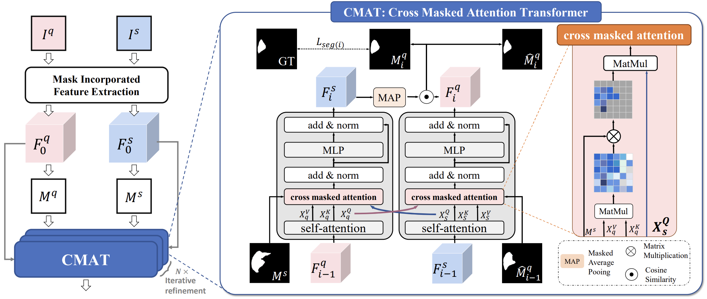

# 3D Masked Attention Transformer (3D-CAT-Net)

## Highlights
<p align="justify">
We extend the few-shot medical image segmentation model, Cross Masked Attention Transformer (CAT-Net), to 3D medical image segmentation. The CAT-Net mines the correlations between the support image and query image, limiting them to focus only on useful foreground information and boosting the representation capacity of both the support prototype and query features.

[comment]: <> ()

<div align="center">
Image taken from the original paper. Left: Overview of the CAT-NET; Right: The architecture of CMAT module.
</div> 

### Using the code
Please clone the following repositories:
```
git clone https://github.com/karabomaila/3D-CAT-Net.git
```

### Requirement
```
pip install -r requirements.txt
```

### Data preparation
#### Download
1. **Abdominal MRI**  [Combined Healthy Abdominal Organ Segmentation dataset](https://chaos.grand-challenge.org/)  

#### Pre-processing
Please refer to [Ouyang et al.](https://github.com/cheng-01037/Self-supervised-Fewshot-Medical-Image-Segmentation.git)

### Training
1. Download pre-trained [ResNet-50 weights](https://drive.google.com/file/d/13tnSvXY7oDIEloNFiGTsjUIYfS3g3BfG/view?usp=sharing) and put into your own backbone folder.
2. Run the following command to train the model:
```
sh ./exps/train_Abd.sh
```

### Testing
Run `./exp/validation.sh`

### Visualization
<!-- [comment]: <> ()

<div align="center">
Qualitative results of our method on Abd-CT and Abd-MRI.
</div>  -->

## Acknowledgment 
This code is based on [CAT-Net](https://github.com/hust-linyi/CAT-Net), thanks for their excellent work!
